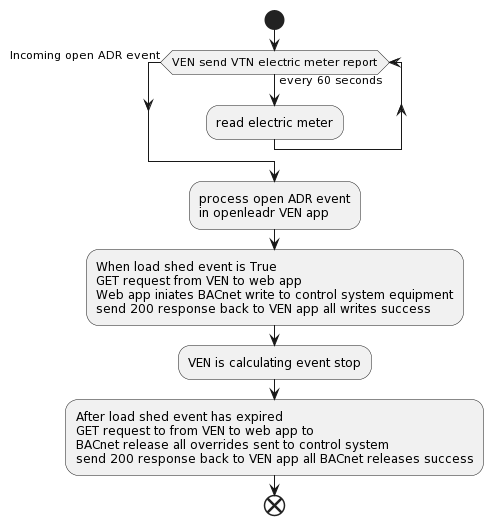

OpenLEADR Example BACnet Web Server VEN
===================================

Coming soon...for simple signal load shed a Flask web app running a BACnet stack can write to all BACnet adjustable loads inside the building with web interface for building operators to release BACnet commands. Openleadr VEN app to trigger BACnet writes and BACnet releases when the open ADR event has expired.

